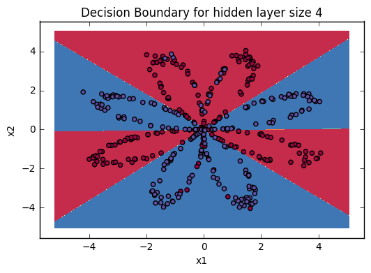

np.meshgrid()
从坐标向量返回坐标矩阵，生成网格数据。
例如：
```
x = np.arange(-2,2)
y = np.arange(0,3)#生成一位数组，其实也就是向量

x
Out[31]: array([-2, -1,  0,  1])

y
Out[32]: array([0, 1, 2])

z,s = np.meshgrid(x,y)#将两个一维数组变为二维矩阵

z
Out[36]: 
array([[-2, -1,  0,  1],
       [-2, -1,  0,  1],
       [-2, -1,  0,  1]])

s
Out[37]: 
array([[0, 0, 0, 0],
       [1, 1, 1, 1],
       [2, 2, 2, 2]])
```
z 和 s 就构成了一个坐标矩阵 (-2,0),(-1,0),(0,0),(1,0),(-2,1),(-1,1),(0,1) ... (2,0),(2,1)。实际上就是一个网格。

用matplotlib画等高线图，contourf可以填充等高线之间的空隙颜色，呈现出区域的分划状，所以很多分类机器学习模型的可视化常会借助其展现。
核心函数是plt.contourf()，输入的参数是x,y对应的网格数据以及此网格对应的高度值。
```
import numpy as np
import pandas as pd
import matplotlib.pyplot as plt
 
# 计算x,y坐标对应的高度值
def f(x, y):
 return (1-x/2+x**5+y**3) * np.exp(-x**2-y**2)
 
# 生成x,y的数据
n = 256
x = np.linspace(-3, 3, n)
y = np.linspace(-3, 3, n)
 
# 把x,y数据生成mesh网格状的数据，因为等高线的显示是在网格的基础上添加上高度值
X, Y = np.meshgrid(x, y)
 
# 填充等高线
plt.contourf(X, Y, f(X, Y))
# 显示图表
plt.show()
```

plt.contourf(xx, yy, Z, cmap=plt.cm.Spectral)
cmap = plt.cm.Spectral 实现的功能是给label为1的点一种颜色，给label为0的点另一种颜色。

tips:
计算正确率的向量方法，np.dot()进行矩阵乘法，如果相同，则乘积和为1，反之为0。

```
float((np.dot(Y,LR_predictions) + np.dot(1-Y,1-LR_predictions))/float(Y.size)*100)
```

有时为保证能重现结果，设置相同的seed，每次生成的随机数相同。

```
np.random.seed(2) # we set up a seed so that your output matches ours although the initialization is random.
```

#### 公式

对于 $x^{(i)}$:
$$z^{[1] (i)} =  W^{[1]} x^{(i)} + b^{[1] (i)}$$ 
$$a^{[1] (i)} = \tanh(z^{[1] (i)})$$
$$z^{[2] (i)} = W^{[2]} a^{[1] (i)} + b^{[2] (i)}$$
$$\hat{y}^{(i)} = a^{[2] (i)} = \sigma(z^{ [2] (i)})$$

$$y^{(i)}_{prediction} =
\begin{cases}
1& \hat{y}^{(i)} > 0.5 \\\\
0& \text{otherwise}
\end{cases}$$


使用下面公式计算损失 $J$ : 
$$J = - \frac{1}{m} \sum\limits_{i = 0}^{m} \large\left(\small y^{(i)}\log\left(a^{[2] (i)}\right) + (1-y^{(i)})\log\left(1- a^{[2] (i)}\right)  \large  \right) \small $$

#### 神经网络结构


#### 算法步骤

1. 定义神经网络结构：输入单元数量、隐藏单元数量、输出单元数量。

```
def layer_sizes(X, Y):
    # X:(input size, number of examples) Y:(output size, number of examples)
    n_x = X.shape[0] # the size of the input layer
    n_h = 4 # the size of the hidden layer
    n_y = Y.shape[0] #the size of the output layer
    return (n_x, n_h, n_y)
```

2. 初始化模型参数

```
def initialize_parameters(n_x, n_h, n_y):   
    W1 = np.random.randn(n_h, n_x) * 0.01 # n_x 向量的数量 n_y 向量的维度 (n[l],n[l-1])
    b1 = np.zeros((n_h,1))
    W2 = np.random.randn(n_y, n_h) * 0.01
    b2 = np.zeros((n_y,1))
    parameters = {"W1": W1,
                  "b1": b1,
                  "W2": W2,
                  "b2": b2}  
    return parameters
```

3. 实现前向传播

```
def forward_propagation(X, parameters):
    # Retrieve each parameter from the dictionary "parameters"
    W1 = parameters["W1"]
    b1 = parameters["b1"]
    W2 = parameters["W2"]
    b2 = parameters["b2"]
    
    # Implement Forward Propagation to calculate A2 (probabilities)
    Z1 = np.dot(W1,X) + b1
    A1 = np.tanh(Z1)
    Z2 = np.dot(W2,A1) + b2
    A2 = sigmoid(Z2)

    cache = {"Z1": Z1,
             "A1": A1,
             "Z2": Z2,
             "A2": A2}
    
    return A2, cache
```

4. 计算损失函数

```
def compute_cost(A2, Y, parameters):

    m = Y.shape[1] # number of example

    # Compute the cross-entropy cost
    logprobs = np.multiply(np.log(A2),Y) + np.multiply(np.log(1-A2),1-Y)
    cost = -np.sum(logprobs) / m
    
    cost = np.squeeze(cost)     # makes sure cost is the dimension we expect. 
                                # E.g., turns [[17]] into 17    
    return cost
```

5. 计算反向传播

```
def backward_propagation(parameters, cache, X, Y):
  
    m = X.shape[1]
    
    # First, retrieve W1 and W2 from the dictionary "parameters".
    W1 = parameters['W1']
    W2 = parameters['W2']
    
    # Retrieve also A1 and A2 from dictionary "cache".
    A1 = cache['A1']
    A2 = cache['A2']
    
    # Backward propagation: calculate dW1, db1, dW2, db2. 
    dZ2 = A2 - Y
    dW2 = np.dot(dZ2, A1.T) / m
    db2 = np.sum(dZ2,axis=1,keepdims=True) / m
    dZ1 = np.dot(W2.T, dZ2) * (1 - np.power(A1, 2))
    #dZ1 = np.dot(W2.T, dZ2) * np.maximum(0,A1)
    dW1 = np.dot(dZ1, X.T) / m
    db1 = np.sum(dZ1,axis=1,keepdims=True) / m
    
    grads = {"dW1": dW1,
             "db1": db1,
             "dW2": dW2,
             "db2": db2}   
    return grads
```

6. 更新参数

```
def update_parameters(parameters, grads, learning_rate = 1.2):
   
    # Retrieve each parameter from the dictionary "parameters"
    W1 = parameters['W1']
    W2 = parameters['W2']
    b1 = parameters['b1']
    b2 = parameters['b2']
    
    # Retrieve each gradient from the dictionary "grads"
    dW1 = grads['dW1']
    dW2 = grads['dW2']
    db1 = grads['db1']
    db2 = grads['db2'] 
    
    # Update rule for each parameter
    W1 = W1 - learning_rate*dW1
    W2 = W2 - learning_rate*dW2
    b1 = b1 - learning_rate*db1
    b2 = b2 - learning_rate*db2
 
    parameters = {"W1": W1,
                  "b1": b1,
                  "W2": W2,
                  "b2": b2}   
    return parameters
```

7. 将上述几步结合，实现最后的模型

```
def nn_model(X, Y, n_h, num_iterations = 10000, print_cost=False):
    n_x = layer_sizes(X, Y)[0]
    n_y = layer_sizes(X, Y)[2]  
    parameters = initialize_parameters(n_x, n_h, n_y)
    W1 = parameters['W1']
    W2 = parameters['W2']
    b1 = parameters['b1']
    b2 = parameters['b2']   
    # Loop (gradient descent)
    for i in range(0, num_iterations):      
        # Forward propagation. 
        A2, cache = forward_propagation(X, parameters)
        # Cost function.
        cost = compute_cost(A2, Y, parameters)
        # Backpropagation. 
        grads = backward_propagation(parameters, cache, X, Y)
        # Gradient descent parameter update.
        parameters = update_parameters(parameters, grads)
        
        # Print the cost every 1000 iterations
        if print_cost and i % 1000 == 0:
            print ("Cost after iteration %i: %f" %(i, cost))
    return parameters
```

8. 实现预测函数

```
def predict(parameters, X):
    """
    Using the learned parameters, predicts a class for each example in X
    Arguments:
    parameters -- python dictionary containing your parameters 
    X -- input data of size (n_x, m)
    Returns
    predictions -- vector of predictions of our model (red: 0 / blue: 1)
    """
    # Computes probabilities using forward propagation, and classifies to 0/1 using 0.5 as the threshold.
    y_predictions, _ = forward_propagation(X, parameters)
    predictions = (y_predictions > 0.5) 
    return predictions
```

那么怎么调用我们实现的这个模型呢？

```
parameters = nn_model(X, Y, n_h, num_iterations = 5000)
plot_decision_boundary(lambda x: predict(parameters, x.T), X, Y[0, :]) # lambda x: predict(parameters, x.T) 将函数作为参数传递，其中，x 为调用的参数。
predictions = predict(parameters, X)
accuracy = float((np.dot(Y,predictions.T) + np.dot(1-Y,1-predictions.T))/float(Y.size)*100)
print ("Accuracy for {} hidden units: {} %".format(n_h, accuracy))
```

其中，plot_decision_boundary是实现可视化的函数，其实现如下：

```
def plot_decision_boundary(model, X, y):
    # Set min and max values and give it some padding
    x_min, x_max = X[0, :].min() - 1, X[0, :].max() + 1
    y_min, y_max = X[1, :].min() - 1, X[1, :].max() + 1
    h = 0.01
    # Generate a grid of points with distance h between them
    xx, yy = np.meshgrid(np.arange(x_min, x_max, h), np.arange(y_min, y_max, h))
    # Predict the function value for the whole grid
    Z = model(np.c_[xx.ravel(), yy.ravel()]) 
    Z = Z.reshape(xx.shape)
    # Plot the contour and training examples
    plt.contourf(xx, yy, Z, cmap=plt.cm.Spectral)
    plt.ylabel('x2')
    plt.xlabel('x1')
    plt.scatter(X[0, :], X[1, :], c=y, cmap=plt.cm.Spectral)
```

效果类似下图：

