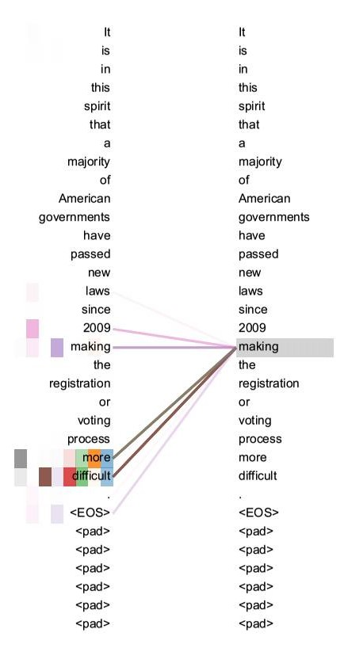

## Background

减少时序计算的目标构成了扩展神经GPU，ByteNet和ConvS2S的基础，它们都使用卷积神经网络作为基本构建块，并行计算所有输入和输出位置的隐藏表示。 在这些模型中，与来自两个任意输入或输出位置的信号相关的操作数量随着位置之间的距离而增加，对于ConvS2S呈线性增长，对于ByteNet呈对数增长，这使得学习远程位置之间的依赖性变得更加困难。 在Transformer中，操作被减少到恒定次数，尽管由于平均注意力加权位置而导致有效分辨率降低，但这种效果我们可以用Multi-Head Attention抵消。

Self-attention 是一种将单个序列的不同位置联系起来以便计算序列表示的注意机制。Self-attention 已经成功地用于各种任务，包括阅读理解，抽象概括，文本蕴涵和学习任务无关的句子表示。 端到端记忆网络基于循环注意机制而不是序列对齐重复，并且已经证明在简单语言问答和语言建模任务上表现良好。

据我们所知，Transformer 是第一个完全依靠自我注意的转换模型，用于计算其输入和输出的表示，而不是使用序列对齐的RNN或卷积。

## Model Architecture

大多数的神经序列转换模型都具有 encoder-decoder 结构。这里，编码器将符号表示的输入序列$(x_1, ..., x_n)$映射到连续表示序列$\mathbf{z} = (z_1, ..., z_n)$。给定$\mathbf{z}$，解码器然后一次一个元素地生成符号的输出序列 $(y_1,...,y_m)$。在每个步骤中，模型是自回归的，在生成下一个时将先前生成的符号作为附加输入使用。

```
class EncoderDecoder(nn.Module):
    """
    A standard Encoder-Decoder architecture. Base for this and many 
    other models.
    """
    def __init__(self, encoder, decoder, src_embed, tgt_embed, generator):
        super(EncoderDecoder, self).__init__()
        self.encoder = encoder
        self.decoder = decoder
        self.src_embed = src_embed
        self.tgt_embed = tgt_embed
        self.generator = generator
        
    def forward(self, src, tgt, src_mask, tgt_mask):
        "Take in and process masked src and target sequences."
        return self.decode(self.encode(src, src_mask), src_mask,
                            tgt, tgt_mask)
    
    def encode(self, src, src_mask):
        return self.encoder(self.src_embed(src), src_mask)
    
    def decode(self, memory, src_mask, tgt, tgt_mask):
        return self.decoder(self.tgt_embed(tgt), memory, src_mask, tgt_mask)
```

```
class Generator(nn.Module):
    "Define standard linear + softmax generation step."
    def __init__(self, d_model, vocab):
        super(Generator, self).__init__()
        self.proj = nn.Linear(d_model, vocab)

    def forward(self, x):
        return F.log_softmax(self.proj(x), dim=-1)
```
Transformer遵循这种总体架构，使用针对编码器和解码器的堆叠式self-attention 和点式完全连接的层，分别如下图的左半部分和右半部分所示。


## Encoder and Decoder Stacks
### Encoder
编码器由N = 6个相同的层堆叠组成。

```
def clones(module, N):
    "Produce N identical layers."
    return nn.ModuleList([copy.deepcopy(module) for _ in range(N)])
```

```
class Encoder(nn.Module):
    "Core encoder is a stack of N layers"
    def __init__(self, layer, N):
        super(Encoder, self).__init__()
        self.layers = clones(layer, N)
        self.norm = LayerNorm(layer.size)
        
    def forward(self, x, mask):
        "Pass the input (and mask) through each layer in turn."
        for layer in self.layers:
            x = layer(x, mask)
        return self.norm(x)
```
我们在两个子层中的使用残差连接，然后进行[规范化](https://arxiv.org/abs/1607.06450)。

```
class LayerNorm(nn.Module):
    "Construct a layernorm module (See citation for details)."
    def __init__(self, features, eps=1e-6):
        super(LayerNorm, self).__init__()
        self.a_2 = nn.Parameter(torch.ones(features))
        self.b_2 = nn.Parameter(torch.zeros(features))
        self.eps = eps

    def forward(self, x):
        mean = x.mean(-1, keepdim=True)
        std = x.std(-1, keepdim=True)
        return self.a_2 * (x - mean) / (std + self.eps) + self.b_2
```

使用残差连接后，每个子层的输出是$\mathrm{LayerNorm}(x + \mathrm{Sublayer}(x))$，其中$\mathrm{Sublayer}(x)$是由子层本身实现的功能。 我们将dropout应用于每个子层的输出，然后将其与子层输入相加并进行规范化。

为了使残差连接更容易，模型中的所有子层以及嵌入层的输出维度$d_{model}=512$。

```
class SublayerConnection(nn.Module):
    """
    A residual connection followed by a layer norm.
    Note for code simplicity the norm is first as opposed to last.
    """
    def __init__(self, size, dropout):
        super(SublayerConnection, self).__init__()
        self.norm = LayerNorm(size)
        self.dropout = nn.Dropout(dropout)

    def forward(self, x, sublayer):
        "Apply residual connection to any sublayer with the same size."
        return x + self.dropout(sublayer(self.norm(x)))
```
每层有两个子层：第一个是multi-head self-attention，第二种是一个简单的全连接网络。
```
class EncoderLayer(nn.Module):
    "Encoder is made up of self-attn and feed forward (defined below)"
    def __init__(self, size, self_attn, feed_forward, dropout):
        super(EncoderLayer, self).__init__()
        self.self_attn = self_attn
        self.feed_forward = feed_forward
        self.sublayer = clones(SublayerConnection(size, dropout), 2)
        self.size = size

    def forward(self, x, mask):
        "Follow Figure 1 (left) for connections."
        x = self.sublayer[0](x, lambda x: self.self_attn(x, x, x, mask))
        return self.sublayer[1](x, self.feed_forward)
```

### Decoder
解码器也由N = 6个相同的层堆叠组成。

```
class Decoder(nn.Module):
    "Generic N layer decoder with masking."
    def __init__(self, layer, N):
        super(Decoder, self).__init__()
        self.layers = clones(layer, N)
        self.norm = LayerNorm(layer.size)
        
    def forward(self, x, memory, src_mask, tgt_mask):
        for layer in self.layers:
            x = layer(x, memory, src_mask, tgt_mask)
        return self.norm(x)
```

除了编码器层中的两个子层之外，解码器在中间插入了一个子层，其对编码器的输出执行multi-head self-attention。 与编码器类似，我们在每个子层周围使用残差连接，然后进行规范化。

```
class DecoderLayer(nn.Module):
    "Decoder is made of self-attn, src-attn, and feed forward (defined below)"
    def __init__(self, size, self_attn, src_attn, feed_forward, dropout):
        super(DecoderLayer, self).__init__()
        self.size = size
        self.self_attn = self_attn
        self.src_attn = src_attn
        self.feed_forward = feed_forward
        self.sublayer = clones(SublayerConnection(size, dropout), 3)
 
    def forward(self, x, memory, src_mask, tgt_mask):
        "Follow Figure 1 (right) for connections."
        m = memory
        x = self.sublayer[0](x, lambda x: self.self_attn(x, x, x, tgt_mask))
        x = self.sublayer[1](x, lambda x: self.src_attn(x, m, m, src_mask))
        return self.sublayer[2](x, self.feed_forward)
```

我们还修改解码器堆栈中的自注意子层以防止某位置关注其后续位置。 这种掩蔽确保了位置$i$的预测仅依赖于小于$i$的位置的已知输出。
```
def subsequent_mask(size):
    "Mask out subsequent positions."
    attn_shape = (1, size, size)
    # 返回一个下三角矩阵， k = 0代表主对角线， k < 0 在其下，k > 0 在其上，保留对角线下的值，上的置为0 
    subsequent_mask = np.triu(np.ones(attn_shape), k=1).astype('uint8') 
    return torch.from_numpy(subsequent_mask) == 0 # 为0的位置为true，允许查看的位置
```
```
plt.figure(figsize=(5,5))
plt.imshow(subsequent_mask(20)[0])
None
```
我们把掩模可视化，下图显示允许每个target word（行）查看的位置（列），黄色代表允许查看。


## Attention


将Source中的构成元素想象成是由一系列的<Key,Value>数据对构成，此时给定Target中的某个元素Query，通过计算Query和各个Key的相似性或者相关性，得到每个Key对应Value的权重系数，然后对Value进行加权求和，即得到了最终的Attention数值。所以本质上Attention机制是对Source中元素的Value值进行加权求和，而Query和Key用来计算对应Value的权重系数。

Self Attention 指的不是Target和Source之间的Attention机制，而是Source内部元素之间或者Target内部元素之间发生的Attention机制，也可以理解为Target=Source这种特殊情况下的注意力计算机制。



从两张图可以看出，Self Attention可以捕获同一个句子中单词之间的一些句法特征（比如第一张展示的有一定距离的短语结构）或者语义特征（比如第二张展示的its的指代对象Law）。

很明显，引入Self Attention后会更容易捕获句子中长距离的相互依赖的特征，因为如果是RNN或者LSTM，需要依次序序列计算，对于远距离的相互依赖的特征，要经过若干时间步步骤的信息累积才能将两者联系起来，而距离越远，有效捕获的可能性越小。

但是Self Attention在计算过程中会直接将句子中任意两个单词的联系通过一个计算步骤直接联系起来，所以远距离依赖特征之间的距离被极大缩短，有利于有效地利用这些特征。除此外，Self Attention对于增加计算的并行性也有直接帮助作用。这是为何Self Attention逐渐被广泛使用的主要原因。

我们称我们的Attention 为 “Scaled Dot-Product Attention”。 输入包括维度为 $d_k$的 Query 和 Key 以及维度$d_v$的 Value。 我们计算Query和所有Key的点积，并除以$\sqrt{d_k}$，并应用softmax函数来获得值的权重。


在实践中，我们将一组Query组合成一个矩阵$Q$。Key和Value也分别组合成一个矩阵$K$和$V$。Attention 计算公式如下：
$$                                                                         
   \mathrm{Attention}(Q, K, V) = \mathrm{softmax}(\frac{QK^T}{\sqrt{d_k}})V            
$$ 

```
def attention(query, key, value, mask=None, dropout=None):
    "Compute 'Scaled Dot Product Attention'"
    d_k = query.size(-1)
    scores = torch.matmul(query, key.transpose(-2, -1)) \
             / math.sqrt(d_k)
    if mask is not None:
        scores = scores.masked_fill(mask == 0, -1e9)
    p_attn = F.softmax(scores, dim = -1)
    if dropout is not None:
        p_attn = dropout(p_attn)
    return torch.matmul(p_attn, value), p_attn
```

两个最常用的Attention函数是 Additive Attention 和 Dot-product Attention。 除了除以一个比例因子$\sqrt{d_k}$之外，Dot-product Attention与我们的算法相同。 Additive Attention使用具有单个隐藏层的前馈网络来计算。 虽然这两者在理论复杂性上相似，但实际上点积更快，更节省空间，因为它可以使用高度优化的矩阵乘法码来实现。

虽然对于较小的dk值，两种机制的表现相似，但是Additive Attention优于Dot-product Attention，因为对于更大的$d_k$不会进行缩放。 我们猜想，对于较大的$d_k$值，点积会大幅增大，从而将softmax函数的值映射到具有极小梯度的区域（为了说明点积变大的原因，我们假设$q$和$k$的分量是平均值为0且方差为1的独立随机变量，它们的点积$q \cdot k = \sum_{i=1}^{d_k} q_ik_i$，平均值为$0$，方差为$d_k$）。 为了抵消这种影响，故我们将点积缩放$\frac{1}{\sqrt{d_k}}$。


Multi-Head Attention 就是把Scaled Dot-Product Attention的过程做H次，然后把输出Z合起来。
$$    
\mathrm{MultiHead}(Q, K, V) = \mathrm{Concat}(\mathrm{head_1}, ..., \mathrm{head_h})W^O    \\                                           
    \text{where}~\mathrm{head_i} = \mathrm{Attention}(QW^Q_i, KW^K_i, VW^V_i)                                
$$                                                                                               
其中，$W^Q_i \in \mathbb{R}^{d_{\text{model}} \times d_k}$, $W^K_i \in \mathbb{R}^{d_{\text{model}} \times d_k}$, $W^V_i \in \mathbb{R}^{d_{\text{model}} \times d_v}$ and $W^O \in \mathbb{R}^{hd_v \times d_{\text{model}}}$.  
对单词的嵌入变换，分别与$W^q$，$W^k$，$W^v$三个矩阵做点乘得到缩小后的Query，Key，Value。
我们进行$h=8$个Attention，对于每一个Attention，我们令$d_k=d_v=d_{\text{model}}/h=64$。由于每个head的尺寸都减小，总的计算成本与具有全维度的单个Attention差不多。

```
class MultiHeadedAttention(nn.Module):
    def __init__(self, h, d_model, dropout=0.1):
        "Take in model size and number of heads."
        super(MultiHeadedAttention, self).__init__()
        assert d_model % h == 0
        # We assume d_v always equals d_k
        self.d_k = d_model // h
        self.h = h
        self.linears = clones(nn.Linear(d_model, d_model), 4)
        self.attn = None
        self.dropout = nn.Dropout(p=dropout)
        
    def forward(self, query, key, value, mask=None):
        "Implements Figure 2"
        if mask is not None:
            # Same mask applied to all h heads.
            mask = mask.unsqueeze(1)
        nbatches = query.size(0)
        
        # 1) Do all the linear projections in batch from d_model => h x d_k 
        query, key, value = \
            [l(x).view(nbatches, -1, self.h, self.d_k).transpose(1, 2)
             for l, x in zip(self.linears, (query, key, value))]
        
        # 2) Apply attention on all the projected vectors in batch. 
        x, self.attn = attention(query, key, value, mask=mask, 
                                 dropout=self.dropout)
        
        # 3) "Concat" using a view and apply a final linear. 
        x = x.transpose(1, 2).contiguous() \
             .view(nbatches, -1, self.h * self.d_k)
        return self.linears[-1](x)
```

## Position-wise Feed-Forward Networks
在进行了Attention操作之后，encoder和decoder中的每一层都包含了一个全连接前向网络，对每个position的向量分别进行相同的操作，包括两个线性变换和一个ReLU激活输出
$$\mathrm{FFN}(x)=\max(0, xW_1 + b_1) W_2 + b_2$$   
虽然线性变换在不同位置上是相同的，但两个线性变换的参数是不同的。 输入和输出的维度是$d_{model} = 512$，内层的维度$d_{ff} = 2048$。
```
class PositionwiseFeedForward(nn.Module):
    "Implements FFN equation."
    def __init__(self, d_model, d_ff, dropout=0.1):
        super(PositionwiseFeedForward, self).__init__()
        self.w_1 = nn.Linear(d_model, d_ff)
        self.w_2 = nn.Linear(d_ff, d_model)
        self.dropout = nn.Dropout(dropout)

    def forward(self, x):
        return self.w_2(self.dropout(F.relu(self.w_1(x))))
```
## Embeddings and Softmax
类似于其他序列转换模型，我们使用学习的嵌入将输入令牌和输出令牌转换为维度dmodel的向量。我们还使用通常学习的线性变换和softmax函数将解码器输出转换为预测的下一令牌概率。在我们的模型中，我们在两个嵌入层和预软最大线性变换之间共享相同的权重矩阵，类似于（引用）。在嵌入层中，我们通过dMe-ε-ε的乘法将这些权值相乘。
类似于其他序列转换模型，我们使用学习嵌入将输入和输出tokens转换为维度为$d_{model}$的向量。 我们还使用线性变换和softmax函数将解码器的输出转换为下一个词是哪一个的概率。 在我们的模型中，我们在两个嵌入层和pre-softmax线性变换之间共享相同的权重矩阵。 在嵌入层中，我们将这些权重乘以$\sqrt{d_{model}}$。
```
class Embeddings(nn.Module):
    def __init__(self, d_model, vocab):
        super(Embeddings, self).__init__()
        self.lut = nn.Embedding(vocab, d_model)
        self.d_model = d_model

    def forward(self, x):
        return self.lut(x) * math.sqrt(self.d_model)
```

## Positional Encoding
因为模型不包括Recurrence/Convolution，因此是无法捕捉到序列顺序信息的，例如将K、V按行进行打乱，那么Attention之后的结果是一样的。但是序列信息非常重要，代表着全局的结构，因此必须将序列的分词相对或者绝对position信息利用起来。

这里每个分词的position embedding向量维度也是, 然后将原本的input embedding和position embedding加起来组成最终的embedding作为encoder/decoder的输入。其中position embedding计算公式如下：
$$PE_{(pos,2i)} = sin(pos / 10000^{2i/d_{\text{model}}})$$

$$PE_{(pos,2i+1)} = cos(pos / 10000^{2i/d_{\text{model}}})$$    
其中 pos 表示位置index， i 表示维度的index。 

波长形成从2π到10000⋅2π的几何级数。 我们选择这个函数，是因为我们假设它可以让模型轻松地学习相对位置，因为对于任何固定偏移$k$，$PE_{pos+k}$可以表示为$PE_{pos}$的线性函数。
$$
sin(\alpha + \beta) = sin(\alpha)cos(\beta)+cos(\alpha)sin(\beta)
$$
$$
cos(\alpha + \beta) = cos(\alpha)cos(\beta)- sin(\alpha)sin(\beta)
$$

此外，我们将dropout应用于编码器和解码器堆栈中嵌入和位置编码的总和。 对于基本模型，我们使用$P_{drop}=0.1$。
```
class PositionalEncoding(nn.Module):
    "Implement the PE function."
    def __init__(self, d_model, dropout, max_len=5000):
        super(PositionalEncoding, self).__init__()
        self.dropout = nn.Dropout(p=dropout)
        
        # Compute the positional encodings once in log space.
        pe = torch.zeros(max_len, d_model)
        position = torch.arange(0, max_len).unsqueeze(1)
        div_term = torch.exp(torch.arange(0, d_model, 2) *
                             -(math.log(10000.0) / d_model))
        pe[:, 0::2] = torch.sin(position * div_term)
        pe[:, 1::2] = torch.cos(position * div_term)
        pe = pe.unsqueeze(0)
        self.register_buffer('pe', pe)
        
    def forward(self, x):
        x = x + Variable(self.pe[:, :x.size(1)], 
                         requires_grad=False)
        return self.dropout(x)
```
下面的位置编码将根据位置添加正弦波。波的频率和偏移对于每个维度是不同的。


## Full Model
这里我们定义了一个函数，它包含超参数并产生一个完整的模型。
```
def make_model(src_vocab, tgt_vocab, N=6, 
               d_model=512, d_ff=2048, h=8, dropout=0.1):
    "Helper: Construct a model from hyperparameters."
    c = copy.deepcopy
    attn = MultiHeadedAttention(h, d_model)
    ff = PositionwiseFeedForward(d_model, d_ff, dropout)
    position = PositionalEncoding(d_model, dropout)
    model = EncoderDecoder(
        Encoder(EncoderLayer(d_model, c(attn), c(ff), dropout), N),
        Decoder(DecoderLayer(d_model, c(attn), c(attn), 
                             c(ff), dropout), N),
        nn.Sequential(Embeddings(d_model, src_vocab), c(position)),
        nn.Sequential(Embeddings(d_model, tgt_vocab), c(position)),
        Generator(d_model, tgt_vocab))
    
    # This was important from their code. 
    # Initialize parameters with Glorot / fan_avg.
    for p in model.parameters():
        if p.dim() > 1:
            nn.init.xavier_uniform(p)
    return model
```
```
# Small example model.
tmp_model = make_model(10, 10, 2)
None
```


## Reference


