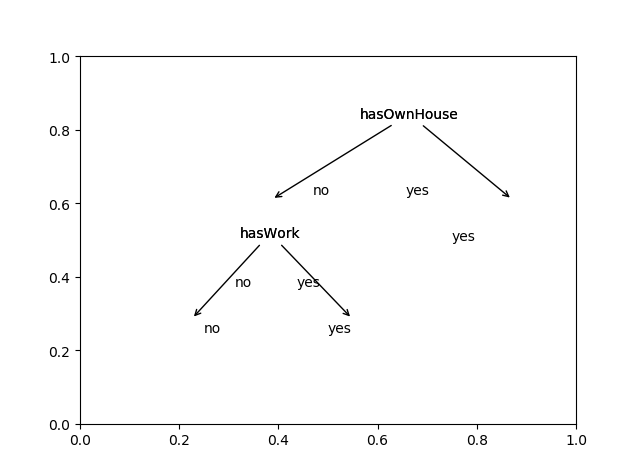

## 理论
### 什么是决策树？
决策树内部节点表示一个特征或属性，叶节点表示一个类，进行分类时，从根节点开始，对实例的某一特征进行测试，根据测试结果，将实例分配到其子节点，这时每一个子节点对应着该特征的一个取值，如此递归地对实例进行测试并分配，直至到达叶节点，最后将实例分到叶节点地类中。
可以将决策树看成一个if-then规则的集合，每一个实例都被一条路径或一条规则所覆盖，而且只被一条路径或一条规则所覆盖，互斥并且完备。同时，决策树还表示给定特征条件下类的条件概率分布，定义了特征空间的一个划分，分为互不相交的几个单元，决策树的一条路径就对应划分中的一个单元，决策树分类时将实例分到条件概率大的一类去。

### 决策树学习
决策树学习通常包括3个步骤：特征选择、决策树的生成和决策树的剪枝。决策树学习的算法通常是一个递归地选择最优特征，并根据该特征对训练数据进行分割，使得对各个子数据集有一个最好的分类的过程，这一过程对应着特征空间的划分，也对应着决策树的构建。为了防止过拟合，我们需要对生成的决策树自下而上进行剪枝，去掉过于细分的叶节点，使其回退到父节点，甚至更高的节点，然后将父节点或更高的节点改为新的叶节点。

#### 前提知识
设 $X$ 是一个取有限值的离散随机变量，其概率分布为
$$ P(X=x_i) = p_i,  i=1,2,\cdots,n $$
随机变量$(X,Y)$，其联合概率分布为
$$ P(X=x_i,Y=y_j) = p_{ij},  i=1,2,\cdots,n; j=1,2,\cdots,m; $$

则随机变量 $X$ 的熵定义为
$$ H(X) = -\sum_{i=1}^{n} p_i log(p_i)$$ 

条件熵$H(Y|X)$表示在已知$X$的条件下随机变量$Y$的不确定性，定义为在$X$给定的条件下，$Y$的条件概率分布的熵对$X$的数学期望
$$ H(Y|X) = \sum_{i=1}^{n} p_iH(Y|X=x_i) $$
这里，$p_i =P(X=x_i)$
当熵和条件熵的概率由数据估计得到时，称为经验熵和经验条件熵，如果有$0$概率，则令 $0log0=0$ 

#### 特征选择
特征选择在于选取对训练数据具有分类能力的特征，准则是信息增益或信息增益比。

信息增益表示得知特征$X$的信息而使得类$Y$的信息的不确定性减少的程度，将熵$H(Y)$与条件熵$H(Y|X)$之差称为互信息，决策树学习中的信息增益等价于训练数据集中类与特征的互信息。

给定训练数据集$D$和特征$A$，经验熵$H(D)$表示对数据集$D$进行分类的不确定性，经验条件熵$H(D|A)$表示在特征$A$给定的条件下对数据集$D$进行分类的不确定性，它们的差，即信息增益，表示由于特征$A$而使得对数据集$D$的分类的不确定性减少的程度。在进行特征选择的时候。我们选择信息增益最大的特征，因为信息增益大的特征具有更强的分类能力。
信息增益定义为
$$ g(D,A) = H(D) - H(D|A) $$


设训练数据集为$D$，$|D|$表示其样本容量。设有$K$个类$C_k$，$k=1,2,\cdots,K$, $|C_k|$为属于类$C_k$的样本个数，$\sum_{k=1}^{K}|C_k| = D$。设特征$A$有$n$个不同的取值$\{a_1,a_2,\cdots,a_n\}$，根据特征$A$的取值将$D$划分为$n$个子集$D_1,D_2,\cdots,D_n$，$|D_i|$为$D_i$的样本个数，$\sum_{i=1}^{n}|D_i| = |D|$。记子集$|D_i|$中属于类$|C_k|$的样本的集合为$|D_{ik}|$，即$D_{ik} = D_i \bigcap C_k$，$|D_{ik}|$为$D_{ik}$的样本个数。
计算信息增益的算法如下：

> 输入：训练数据$D$和特征$A$；
输出：特征$A$对训练数据集$D$的信息增益$g(D,A)$。
>1. 计算数据集的经验熵$H(D)$
   $$ H(D) = -\sum_{k=1}^{K} \frac{|C_k|}{|D|}log_2\frac{|C_k|}{|D|}$$
>2. 计算特征$A$对数据集$D$的经验条件熵$H(D|A)$
   $$ H(D|A) = \sum_{i=1}^{n} \frac{|D_i|}{|D|} H(D_i) = -\sum_{i=1}^{n} \frac{|D_i|}{|D|} \sum_{k=1}^{K} \frac{|D_{ik}|}{|D_i|}log_2\frac{|D_{ik}|}{|D_i|}$$
>3. 计算信息增益
   $$ g(D,A) = H(D) - H(D|A) $$


使用信息增益作为划分训练数据集的特征，存在偏向于选择取值较多的特征的问题，使用信息增益比可以进行校正。
信息增益比$g_R(D,A)$定义为其信息增益$g(D,A)$与训练数据集$D$关于特征$A$的值的熵$H_A(D)$之比，即
$$ g_R(D,A) = \frac{g(D,A)}{H_A(D)} $$
其中， $ H_A(D) = -\sum_{i=1}^{n} \frac{|D_i|}{|D|}log_2\frac{|D_i|}{|D|} $。

#### 决策树生成
##### ID3算法
应用信息增益准则选择特征，递归地构建决策树。从根节点开始，对结点计算所有可能的特征的信息增益，选择信息增益最大的特征作为结点的特征，由该特征的不同取值建立子结点；再对子结点递归地调用以上方法，构建决策树；直到所有特征的信息增益均很小或没有特征可以选择为止。
> 输入：训练数据集$D$，特征集$A$，阈值$\epsilon$；
输出：决策树$T$。
> 1. 若$D$中所有实例属于同一类$C_k$，则$T$为单结点树，并将类$C_k$作为该结点的类标记，返回$T$；
> 2. 若 $A = \emptyset$，则$T$为单结点树，并将$D$中实例数最大的类$C_k$作为该结点的类标记，返回$T$；
> 3. 否则，计算$A$中各特征对$D$的信息增益，选择信息增益最大的特征$A_g$；
> 4. 如果$A_g$的信息增益小于阈值$\epsilon$，则置$T$为单结点树，并将$D$中实例数最大的类$C_k$作为该结点的类标记，返回$T$；
> 5. 否则，对$A_g$的每一可能值$a_i$，依$A_g=a_i$将$D$分割为若干非空子集$D_i$，将$D_i$中实例数最大的类作为标记，构建子结点，由结点及其子结点构成树$T$，返回$T$;
> 6. 对第$i$个子结点，以$D_i$为训练集，以$A-\{A_g\}$为特征集，递归地调用1-5步，得到子树$T_i$，返回$T_i$。

##### C4.5算法
使用信息增益比来选择特征，其他与ID3类似。

## 实现
例：有一个由15个样本组成的贷款申请训练数据，数据包括4个特征：年龄，是否有工作，是否有房子，信贷情况，最后一列是类别，是否同意贷款。
数据`train_data.csv`如下：
```
ID,age,hasWork,hasOwnHouse,credit,clazz
1,青年,否,否,一般,否
2,青年,否,否,好,否
3,青年,是,否,好,是
4,青年,是,是,一般,是
5,青年,否,否,一般,否
6,中年,否,否,一般,否
7,中年,否,否,好,否
8,中年,是,是,好,是
9,中年,否,是,非常好,是
10,中年,否,是,非常好,是
11,老年,否,是,非常好,是
12,老年,否,是,好,是
13,老年,是,否,好,是
14,老年,是,否,非常好,是
15,老年,否,否,一般,否
```
决策树实现代码`decisionTree.py`如下：
```
# -*- coding: utf-8 -*-
import pandas as pd
import numpy as np
import queue

class Node:
    def __init__(self, label):
        self.label = label
        self.attribute = None
        self.children = None
        self.x = None
        self.y = None

    def setAttribute(self, attribute):
        self.attribute = attribute

    def setChildren(self, children):
        self.children = children

def entropy(datas, clazz):
    C = datas[clazz].value_counts().values
    D = float(datas.index.size)
    H = -np.sum(C/D * np.log2(C/D))
    return H

def conditional_entropy(datas, clazz, attr):
    sub_d = datas[attr].value_counts()
    label = sub_d.index
    Di = sub_d.values
    D = float(datas.index.size)
    H = []
    for i in range(label.size):
        H.append(entropy(datas[datas[attr]==label[i]], clazz))
    CH = np.sum(Di * H / D)
    return CH

def info_gain(datas, clazz, attr):
    H = entropy(datas, clazz)
    CH = conditional_entropy(datas, clazz, attr)
    G = H - CH
    return G

def info_gain_ratio(datas, clazz, attr):
    G = info_gain(datas, clazz, attr)
    Di = datas[attr].value_counts().values
    D = float(datas.index.size)
    HA = -np.sum(Di / D * np.log2(Di / D))
    GR = G / HA
    return GR


def decisionTree(datas, attrs, clazz, threshold, method = 'ID3'):
    clazz_value_cnts = datas[clazz].value_counts()
    label = clazz_value_cnts.index[0]
    node = Node(label)
    if clazz_value_cnts.size == 1 or attrs.size == 0:
        return node

    IG = np.zeros(attrs.size)
    for i in range(attrs.size):
        if method == 'ID3':
            IG[i] = info_gain(datas, clazz, attrs[i])
        if method == 'C4.5':
            IG[i] = info_gain_ratio(datas, clazz, attrs[i])
    index = IG.argmax()
    attr = attrs[index]
    node.setAttribute(attr)

    if IG.max() < threshold:
        return node

    attrs_value_cnts = datas[attr].value_counts()
    attrs = attrs.drop(attr)
    children = dict()

    for i in range(attrs_value_cnts.size):
        children[attrs_value_cnts.index[i]] = decisionTree(datas[datas[attr]==attrs_value_cnts.index[i]], attrs, clazz, threshold, method)

    node.setChildren(children)
    return node

"""
return tree depth
"""
def getTreeDepth(tree):
    if tree.children == None:
        return 1

    ds = [None] * len(tree.children)
    i = 0
    for node in tree.children.values():
        ds[i] = getTreeDepth(node)
        i = i + 1

    return max(ds) + 1


"""
return the tree's leaves's number
"""

def getLeavesNum(tree):
    if tree.children == None:
        return 1

    num = 0
    for node in tree.children.values():
        num += getLeavesNum(node)

    return num

df = pd.read_csv('train_data.csv', encoding='utf-8')
tree = decisionTree(df, df.columns.drop('clazz').drop('ID'), 'clazz', 0, 'ID3')
printTree(tree)
```
进行可视化代码`plotTree.py`如下：
```
import matplotlib.pyplot as plt
import pandas as pd
import decisionTree as dt


def xy(tree, y):
    global n
    tree.y = y

    if tree.x != None:
        return tree.x

    if tree.children == None:
        x = n * x0
        n += 1
    else:
        xSum = 0
        k = len(tree.children)
        for node in tree.children.values():
            xSum += xy(node, y - y0)
        x = float(xSum) / k

    tree.x = x
    return x


xx = 0.05
yy = 0.08


def pp(tree, ax):
    if tree == None:
        return

    if tree.children != None:
        for key in tree.children.keys():
            ax.annotate(tree.attribute,
                        xy=(tree.children[key].x + xx, tree.children[key].y + yy),
                        xytext=(tree.x, tree.y),
                        xycoords='figure fraction',
                        textcoords='figure fraction',
                        arrowprops=dict(arrowstyle='->')
                        )
            ax.text((tree.children[key].x + tree.x) / 2, (tree.children[key].y + tree.y) / 2, key,
                    transform=ax.transAxes)
            pp(tree.children[key], ax)
    else:
        ax.text(tree.x, tree.y, tree.label, transform=ax.transAxes)


df = pd.read_csv('train_data.csv', encoding='utf-8')
tree = dt.decisionTree(df, df.columns.drop('clazz').drop('ID'), 'clazz', 0, 'ID3')

fig = plt.figure()
ax = fig.add_subplot(1, 1, 1)

h = dt.getTreeDepth(tree)
w = dt.getLeavesNum(tree)

y0 = float(1) / (h + 1)
x0 = float(1) / (w + 1)

n = 1

xy(tree, 1 - y0)
pp(tree, ax)

plt.show()
```

结果展示如下：
