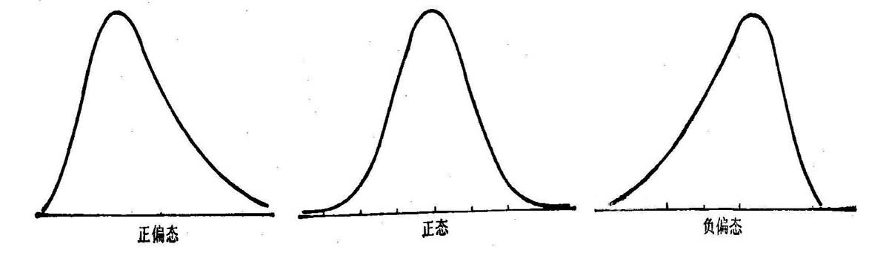
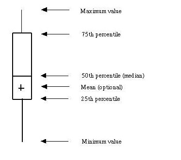
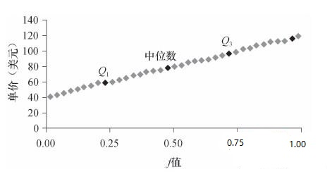
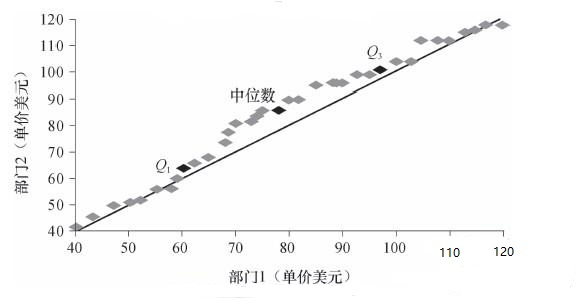

## 数据对象与属性类型
数据集由数据对象组成。一个数据对象代表一个实体。例如销售数据库中，对象可以是顾客、商品。属性是一个数据字段，表示数据对象的一个特征。

### 属性类型

- 标称属性（nominal attribute）：一些事物的名称，每个值代表某种类别、编码或者状态。不具有有意义的序，不是定量的，其均值和中位数无意义，总数有意义。例如，颜色这个对象的属性可能有黑色、红色、白色等，职业可能值有教师、医生等。

- 二元属性（binary attribute）：一种标称属性，只有两个类别或状态：0或1。有对称和非对称两种情况，对称比如性别男女两种状态；非对称比如HIV检测中的阳性和阴性，为了方便，通常用1表示最重要的结果（通常是稀有的，另一个用0编码。

- 序数属性（ordinal attribute）：值之间具有有意义的序，但是相继值之间的差未知。其中心趋势可以用众数和中位数来表示，但不能定义均值。比如成绩有A+、A、A-等。

上面三个都是定性的属性，即它们描述对象的特征而不给出实际大小或数量，其值只代表编码，而不是可测量的量。

- 数值属性（numeric attribute）是定量的，可度量，用整数或实数值表示。
  - 区间标度属性（interval-scaled）：允许比较和定量评估值之间的差，但是没有真正的零点，没有比率或者倍数关系，可以计算中位数，众数和均值。例如，摄氏温度，我们不能说10摄氏度比5摄氏度温暖2倍。
  - 比率标度属性（ratio-scaled）：具有固定零点，可以计算均值、中位数和众数。例如，工作年限、文章字数等计数属性。

## 数据的基本统计描述
我们为了把握数据的全貌，关注数据的中心趋势度量、数据的散布和图形显示。

### 中心趋势度量
中心趋势度量度量数据分布的中部或中心位置，或者说，给定一个属性，它的值大部分落在何处？

#### 均值 (mean)
最常用最有效的是的算术均值：
$$  \overline{x} = \frac{\sum_{i=1}^N x_i}{N} $$
或者使用加权平均，反映对应值的意义、重要性或者出现频率。
$$  \overline{x} = \frac{\sum_{i=1}^N w_ix_i}{\sum_{i=1}^N w_i} $$
但是均值对极端值很敏感，对于非对称数据，数据中心更好的度量是中位数。
#### 中位数 (median)
中位数是有序数据的中间值，将数据分成两半。
中位数在观测数量很大时，计算开销很大。下面给出近似计算公式。假定数据根据值划分成了区间，并且已知每个区间的频率（数据值的个数）。令包含中位数频率的区间为中位数区间。

其中，$L_1$是中位数区间下界，$N$是整个数据集中值的个数，$\sum freq$是低于中位数区间的所有区间的频率和，$freq_{median}$是中位数区间的频率，$width$是中位数区间的宽度。
#### 众数 (mode)
出现最频繁的值。具有有一个、两个、三个众数的数据集合分别成为单峰的（unimodal）、双峰的（bimodal）、三峰的（trimodal）。
当数据对称时，众数 = 中位数 = 均值。
当次数分布右偏时,即正倾斜时，均值受偏高数值影响较大，其位置必然在众数之右，中位数在众数与算术平均数之间，众数 < 中位数 < 均值。
反之，当次数分布左偏时,即负倾斜时，均值受偏小数值的影响较大,其位置在众数之左,中位数仍在两者之间，均值 < 中位数 < 众数。

#### 中列数（midrange）
最大和最小值的平均值。

### 数据的散布

#### 极差（range）
最大值和最小值之差。

#### 四分位数（quartile）
把数据划分成四个基本上大小相等的连贯集合。
$ Q_1 $：有25%的数据在此之下；
$ Q_2 $：有50%的数据在此之下,即中位数；
$ Q_3 $：有75%的数据在此之下。
四分位数极差IQR：给出被数据中间一半所覆盖的范围。
$$ IQR = Q_3 - Q_1 $$
对于倾斜分布，单个散步数值度量如IQR都不是很有用，识别可以离群点的通常规则是挑选落在  $Q_3$ 之上和 $Q_1$ 之下至少 $1.5 * IQR$ 处的值。
五数概括：最小值、$Q_1$、中位数、$Q_3$、最大值。盒图体现了五数概括。

#### 方差（Variance）和标准差（Standard deviation）
$$ \sigma ^2 = \frac{1}{N} \sum_{i=1}^{N}(x_i - \overline{x})^2 $$
$\sigma ^2$ 是方差，$\sigma$是标准差。

### 图形显示
#### 分位数图
设 $x_i$ 是按递增顺序的数据，使得 $x_1$ 是最小的观测值，而 $x_N$ 是最大的，每个观测值$x_i$ 与一个百分数$f_i$对应，指出大约$f_i * 100%$的数据小于值$x_i$。

#### 分位数-分位数图
可以使得用户观察从一个分布到另一个分布是否有漂移。
例如两个部门销售商品的单价数据的分位数-分位数图。

比如在$Q2$,部门1销售的商品50%低于或等于78美元，而部门21销售的商品50%低于或等于85美元。中间那条45度实线代表没有偏移。从总体来看也可以看出部门1销售的商品单价趋向于比部门2低。

#### （频率）直方图

如果数据是标称的，一般称作条形图，数据是数值的，多使用术语直方图。

#### 散点图
散点图是一种观察双变量数据的有用方法。可以通过其看出两个变量是正相关、负相关还是不相关的。

## 度量数据的相似性和相异性

